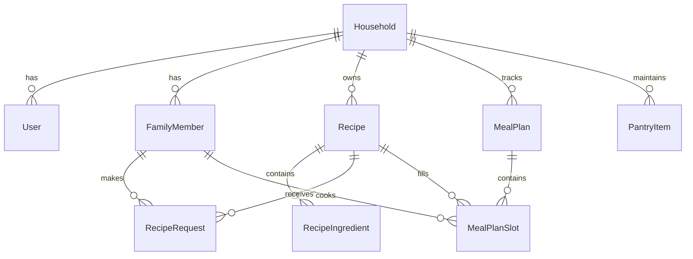

# 🏗️ Architecture & Technology Stack

FamilyPlates is built with modern Rails best practices, adhering to simplicity, low maintenance overhead, and fast execution.

---

## 💻 Tech Stack

* **Framework:** Ruby on Rails 8.1.3
* **Language:** Ruby 4.0 / 3.4
* **Frontend:** Hotwire (Turbo 8 + Stimulus), Tailwind CSS v4, Propshaft Asset Pipeline
* **Database:** SQLite 3 with WAL mode
* **Background Jobs:** Solid Queue (`ActiveJob` backend)
* **Caching & WebSockets:** Solid Cache & Solid Cable
* **Google Integration:** Google Calendar API v3 via `google-apis-calendar_v3` and `googleauth` Service Account JWT authentication

---

## 🗄️ Core Data Models

---

## 🔒 Security & Authentication Model

* **Profile Authentication:** There is no password and no `User` model — both were removed in v1.1.0. Identity is a family-member profile chosen at `/select_profile`. Organizer (`admin`) profiles require a 4-digit PIN; ordinary member profiles are deliberately open, for one-tap switching on a shared kitchen tablet.
* **PIN Storage:** PINs are stored as bcrypt digests (`family_members.pin_digest`) via `has_secure_password`, and cannot be read back off a record. Entry is rate limited per IP and per profile across both entry paths, and comparison is constant-time.
* **Cookie Sessions:** The active profile is held in a signed, `HttpOnly`, `SameSite=Lax` cookie, marked `Secure` when the request arrives over TLS. **A LAN deployment without TLS sends this cookie in the clear** — anyone exposing the app beyond a trusted network should terminate TLS in front of it and enable `config.force_ssl`.
* **Session Secret:** `SECRET_KEY_BASE` signs that cookie, so a predictable value lets anyone forge a session. The app refuses to boot in production on a known placeholder or a value under 32 characters.
* **Credentials Protection:** The Google service account key is encrypted at rest with Active Record encryption, keyed from `ACTIVE_RECORD_ENCRYPTION_PRIMARY_KEY` and `ACTIVE_RECORD_ENCRYPTION_KEY_DERIVATION_SALT`, and is never rendered back into the settings page. Key files remain excluded from git tracking.
