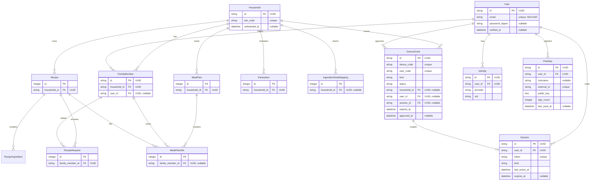

# 🏗️ Architecture & Technology Stack

FamilyPlates is built with modern Rails best practices, adhering to simplicity, low maintenance overhead, and fast execution.

---

## 💻 Tech Stack

* **Framework:** Ruby on Rails 8.1.3
* **Language:** Ruby 4.0 / 3.4
* **Frontend:** Hotwire (Turbo 8 + Stimulus), Tailwind CSS v4, Propshaft Asset Pipeline
* **Database:** SQLite 3 with WAL mode
* **Background Jobs:** Solid Queue (`ActiveJob` backend)
* **Caching & WebSockets:** Solid Cache & Solid Cable
* **Google Integration:** Google Calendar API v3 via `google-apis-calendar_v3` and `googleauth` Service Account JWT authentication

---

## 🗄️ Core Data Models

---

## 🔒 Security & Authentication Model

* **Account & Identity Boundary:** Phase 1 establishes the account boundary via `User`, `Identity`, and `Session` models. `User` holds a nullable `password_digest` for appliance mode while keeping hosted mode passwordless; `Identity` supports multiple login credentials (email, OAuth, passkeys) per user; `Session` provides revocable browser/kiosk session tokens. `FamilyMember.user_id` is an optional foreign key with a per-household uniqueness constraint, allowing family members to attach personal accounts while preserving email-free profiles for children.
* **Kiosk Device Pairing & RFC 8628:** Phase 2 implements a generic RFC 8628 OAuth 2.0 Device Authorization Grant (`DeviceGrant`). A screen (kitchen tablet, fridge display, or browser) displays a QR code and an 8-character user code (`XXXX-XXXX`) while polling `/pair/token`. An authenticated user scans with their phone and approves the pairing as either a non-expiring kitchen display (`kind: "kiosk"`) or a personal browser session (`kind: "browser"`). Kiosk sessions are strictly restricted from accessing `/admin`, editing household settings, or managing connected devices, even if an admin profile enters a valid PIN, and can be revoked at any time from `/devices`.
* **Passkey Authentication & Recovery:** Phase 3 introduces WebAuthn passkeys (`Passkey`) as a first-class, email-free authentication peer to passwords and magic codes. Passkeys enable phishing-resistant, one-touch biometric sign-in via Face ID, Touch ID, Windows Hello, or hardware security keys. Public key credentials and monotonically increasing signature counters are validated locally using dynamic origin / RP ID resolution, allowing passkeys to function in appliance mode over local LAN / mDNS HTTPS connections as well as on hosted custom domains. In appliance mode without SMTP, operator recovery is provided via the command-line password reset task (`rake auth:reset_password[email,password]`), while users are encouraged to register multiple passkeys across devices to ensure redundant access.
* **External Identity Providers & Forward-Auth:** Phase 3 adds optional consumer OAuth (Google, Apple) and self-hosted SSO (generic OpenID Connect and reverse-proxy forward-auth headers such as `Remote-Email`, `X-Forwarded-Email`, and `Tailscale-User-Login`). Every provider is disabled by default. Identity resolution (`User.find_or_create_from_identity`) links incoming external identities to existing accounts matching verified emails without creating duplicate user accounts. For self-hosters running Authelia, Authentik, Traefik, Caddy, or Tailscale, forward-auth headers are strictly gated behind trusted proxy IP/CIDR validation (`FORWARD_AUTH_TRUSTED_PROXIES`) to prevent spoofing, serving as an email-free and password-free authentication path. Users can link and safely disconnect external sign-in methods from account preferences as long as at least one valid credential remains.
* **Profile Authentication:** Daily interaction remains centered on family-member profiles chosen at `/select_profile`. Organizer (`admin`) profiles require a 4-digit PIN; ordinary member profiles are deliberately open for one-tap switching on a shared kitchen tablet.
* **PIN Storage:** PINs are stored as bcrypt digests (`family_members.pin_digest`) via `has_secure_password`, and cannot be read back off a record. Entry is rate limited per IP and per profile across both entry paths, and comparison is constant-time.
* **Cookie Sessions:** The active profile is held in a signed, `HttpOnly`, `SameSite=Lax` cookie, marked `Secure` when the request arrives over TLS. **A LAN deployment without TLS sends this cookie in the clear** — anyone exposing the app beyond a trusted network should terminate TLS in front of it and enable `config.force_ssl`.
* **Session Secret:** `SECRET_KEY_BASE` signs that cookie, so a predictable value lets anyone forge a session. The app refuses to boot in production on a known placeholder or a value under 32 characters.
* **Credentials Protection:** The Google service account key is encrypted at rest with Active Record encryption, keyed from `ACTIVE_RECORD_ENCRYPTION_PRIMARY_KEY` and `ACTIVE_RECORD_ENCRYPTION_KEY_DERIVATION_SALT`, and is never rendered back into the settings page. Key files remain excluded from git tracking.
