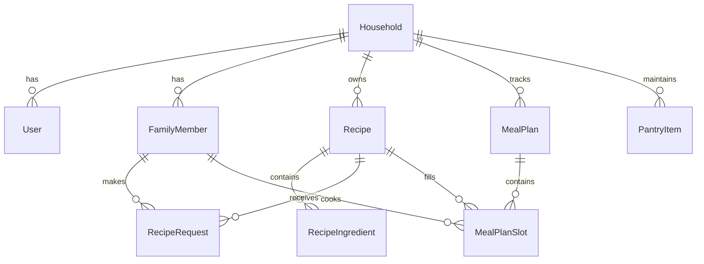

# 🏗️ Architecture & Technology Stack

FamilyPlates is built with modern Rails best practices, adhering to simplicity, low maintenance overhead, and fast execution.

---

## 💻 Tech Stack

* **Framework:** Ruby on Rails 8.1.3
* **Language:** Ruby 4.0 / 3.4
* **Frontend:** Hotwire (Turbo 8 + Stimulus), Tailwind CSS v4, Propshaft Asset Pipeline
* **Database:** SQLite 3 with WAL mode
* **Background Jobs:** Solid Queue (`ActiveJob` backend)
* **Caching & WebSockets:** Solid Cache & Solid Cable
* **Google Integration:** Google Calendar API v3 via `google-apis-calendar_v3` and `googleauth` Service Account JWT authentication

---

## 🗄️ Core Data Models

---

## 🔒 Security & Authentication Model

* **Master Authentication:** Rails 8 `has_secure_password` on `User` model, managing the primary household login session.
* **Cookie Sessions:** HttpOnly secure signed cookies.
* **PIN Encryption & Verification:** 4-digit PINs required for Admin profiles on switch and login.
* **Credentials Protection:** Google Service Account JSON keys are encrypted in database or loaded via environment variables and excluded from git tracking.
