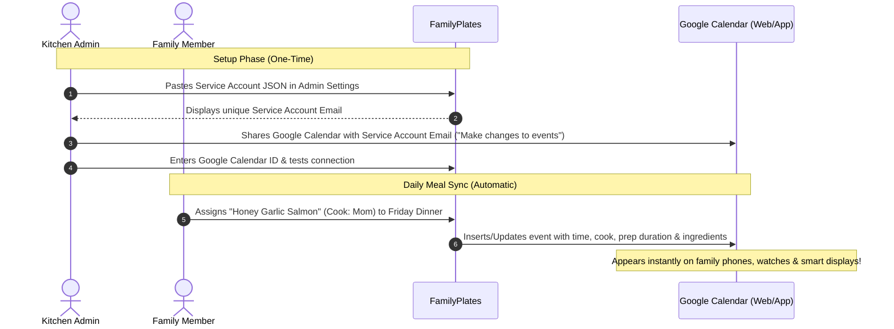

# 📅 Google Calendar Real-Time Sync Guide

FamilyPlates integrates directly with Google Calendar via a **Google Cloud Service Account**. This allows FamilyPlates to automatically create, update, and remove scheduled meal events directly inside your existing family or primary Google Calendar without requiring user OAuth logins or periodic re-authentication.

---

## 🏗️ Architecture & Benefits

### Key Advantages:
* **Zero Token Expiration:** No OAuth refresh tokens that expire or disconnect after 7 days.
* **No Unverified App Warnings:** Avoids Google OAuth consent screen verification requirements.
* **Direct Event Placement:** Events appear directly in your existing shared family calendar rather than a secondary read-only subscription.
* **Rich Event Details:** Includes assigned cook, prep/cook duration, full recipe ingredients list, and custom notes.

---

## 🛠️ Step-by-Step Setup Guide

### Step 1: Create a Project in Google Cloud Console
1. Open the [Google Cloud Console](https://console.cloud.google.com/).
2. Click the project dropdown in the top navigation bar and select **New Project**.
3. Name your project (e.g. `FamilyPlates`) and click **Create**.
4. Make sure your newly created project is selected in the top bar.

---

### Step 2: Enable the Google Calendar API
1. In the Google Cloud Console search bar, type **"Google Calendar API"**.
2. Select **Google Calendar API** from Marketplace results.
3. Click the blue **Enable** button.

---

### Step 3: Create a Service Account
1. From the left sidebar menu (☰), go to **IAM & Admin > Service Accounts**.
2. Click **+ Create Service Account** at the top.
3. Enter service account details:
   * **Service account name:** `familyplates-sync`
   * **Service account ID:** (auto-fills, e.g. `familyplates-sync`)
4. Click **Create and Continue**.
5. You can skip the optional "Grant this service account access to project" step and click **Done**.

---

### Step 4: Generate and Download the JSON Key
1. In the Service Accounts list, click on the email of the service account you just created (`familyplates-sync@...`).
2. Navigate to the **Keys** tab at the top.
3. Click **Add Key > Create new key**.
4. Choose **JSON** as the key type and click **Create**.
5. A `.json` credentials file will download to your computer.

---

### Step 5: Paste JSON Key into FamilyPlates Admin Settings
1. Open the downloaded `.json` file in any text editor (Notepad, VS Code, TextEdit).
2. Copy the entire contents of the file (starts with `{"type": "service_account", ...}`).
3. In FamilyPlates, switch to an **Admin** profile and navigate to **Admin Control Center > Household & Calendar Settings** (`/admin/household/edit`).
4. Paste the JSON text into **Step 1: Service Account JSON Key**.
5. Click **Save Settings**.

---

### Step 6: Share Your Google Calendar with the Service Account
1. Once saved, FamilyPlates will display your unique **Kitchen Bot Email** under **Step 2** with a 1-click **Copy Email** button (e.g., `familyplates-sync@your-project.iam.gserviceaccount.com`).
2. Open [Google Calendar](https://calendar.google.com/) in your browser.
3. In the left sidebar under "My calendars", find the calendar you want to sync meals to (e.g., your primary calendar or shared "Family" calendar).
4. Click the 3 dots **⋮** next to the calendar name and select **Settings and sharing**.
5. Scroll down to **"Share with specific people or groups"** and click **+ Add people and groups**.
6. Paste the Service Account email.
7. Under **Permissions**, select **"Make changes to events"**.
8. Click **Send**.

---

### Step 7: Enter Google Calendar ID & Verify Connection
1. In Google Calendar settings, scroll down to the **"Integrate calendar"** section and copy your **Calendar ID**:
   * For your main personal calendar: use `primary`.
   * For a shared family calendar: use the address ending in `@group.calendar.google.com`.
2. Back in FamilyPlates Admin Settings (`/admin/household/edit`), paste the Calendar ID into **Step 3: Google Calendar ID**.
3. Toggle the **Google Calendar Direct Sync** switch to **ON**.
4. Click **Save Settings**.
5. Click **"Test Google Calendar Connection"** at the bottom of the page. You will see a green confirmation notice:
   > *Google Calendar connection verified successfully! 📅 Target: "Family Calendar"*

---

## 🍽️ Event Structure & Scheduling

FamilyPlates automatically schedules events based on the meal type and your household's configured start times:

| Meal Type | Default Start Time | Duration | Event Summary Example |
| :--- | :--- | :--- | :--- |
| **Breakfast** | `08:00` (8:00 AM) | 45 minutes | `🍽️ Breakfast: Blueberry Oatmeal (Cook: Dad)` |
| **Lunch** | `12:30` (12:30 PM) | 45 minutes | `🍽️ Lunch: Turkey Club Sandwich (Cook: Mom)` |
| **Dinner** | `18:00` (6:00 PM) | 60 minutes | `🍽️ Dinner: Honey Garlic Salmon (Cook: Dad)` |

*Note: You can customize your household's default meal times in **Admin Control Center > Household & Calendar Settings**.*

### Event Body Content
Each Google Calendar event contains:
* 👨‍🍳 **Assigned Cook / Chef**
* ⏱️ **Prep Time, Cook Time, & Servings**
* 📋 **Full Recipe Ingredients List**
* 📝 **Custom Notes & Prep Instructions**

---

## 🔄 Synchronization Lifecycle

* **Automatic Real-Time Sync:** When any meal is assigned, edited, or reassigned in the weekly or monthly planner, a background job (`SyncMealPlanSlotJob`) updates Google Calendar within seconds.
* **Automatic Deletion:** When a meal slot is cleared or deleted, FamilyPlates removes the corresponding event from Google Calendar.
* **Full Week Sync:** On the Weekly Meal Planner page (`/meal_plans/:id`), click **Google Calendar > Sync This Week Now** to re-sync all 7 days of breakfast, lunch, and dinner.

---

## ❓ Troubleshooting & FAQs

### "Google Calendar connection failed: Not Found"
* **Cause:** The Google Calendar ID is incorrect, or the Service Account email has not been invited with "Make changes to events" permission.
* **Fix:** Double-check that you copied the exact Calendar ID from Google Calendar Settings > Integrate Calendar, and verify that the Service Account email is listed under "Share with specific people".

### "Google Service Account JSON key is missing"
* **Cause:** The JSON key has not been pasted into Admin settings or environment variables.
* **Fix:** Copy the contents of your downloaded `.json` key and paste it into `/admin/household/edit` under Step 1.
